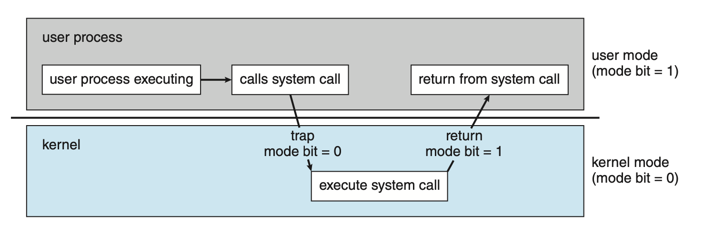

# What is Operating System?

## 1. Definition

- **운영체제**는 컴퓨터의 소프트웨어 자원들과 컴퓨터 하드웨어 사이의 중간자 역할을 담당하는 **소프트웨어**이다. 대부분의 소프트웨어들은 하드웨어와 직접적으로 상호작용 할 수 없기 때문에 운영체제가 그 역할을 대신한다.

## 2. Role

- 운영체제는 컴퓨터의 모든 **자원**과 **프로그램(프로세스)의 실행**을 관리한다. 컴퓨터의 자원(resource)이란 Memory와 CPU를 의미한다.

  - `CPU 관리`: 사용자가 프로그램을 실행하면 OS는 secondary storage에서 프로그램에 해당하는 데이터를 컴퓨터의 main memory에 로드(load)한다. 이후 운영체제는 scheduler를 통해 CPU가 **multi-tasking**을 실현할 수 있도록 한다. 또한 인터럽트를 통해 CPU와 I/O device의 작동을 관리한다.
  - `Memory 관리`: 각각의 프로세스는 메모리를 할당 받는다.

* 사용자 입장에서 운영체제는 **편의성**과 **생산성**을 위한 소프트웨어이다.
  - 운영체제는 복잡한 하드웨어의 작동을 사용자로부터 숨긴다.
  - 사용자는 운영체제로부터 user interface를 제공받는다.
    > CLI (Client User Interface), GUI (Graphic User Interface)

## 3. Kernel
  - 시스템이 정상적으로 동작하기 위해서는 운영체제의 코드와 사용자 프로그램의 코드가 구분되어야 한다. 이를 위해 대부분의 시스템은 `user mode`와 `kernel mode`를 구분하여 동작한다.
    > kernel은 컴퓨터에서 항상 실행되는 하나의 프로그램이다. kernel 이외의 프로그램은 모두 사용자 프로그램이거나 시스템 프로그램이다.

    

  - 위 그림처럼 인터럽트의 한 종류인 **trap**을 통해 `user mode`에서 `kernel mode`로 이동할 수 있다.
  - `user mode`와 `kernel mode`는 RAM을 두 공간으로 분리하여 실행된다. kernel 코드는 컴퓨터가 부팅될 때 디스크에서 RAM으로 로드된다.
