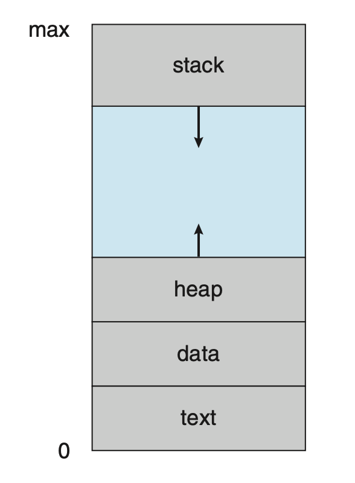
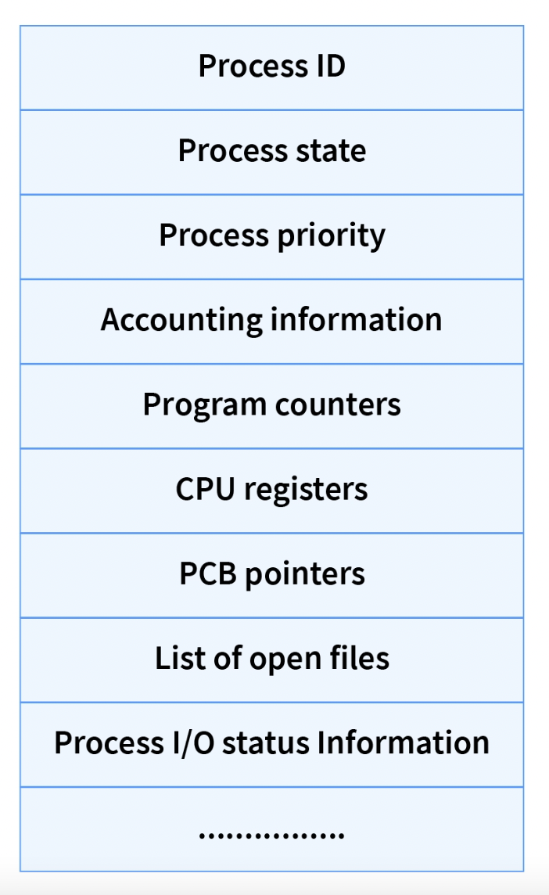
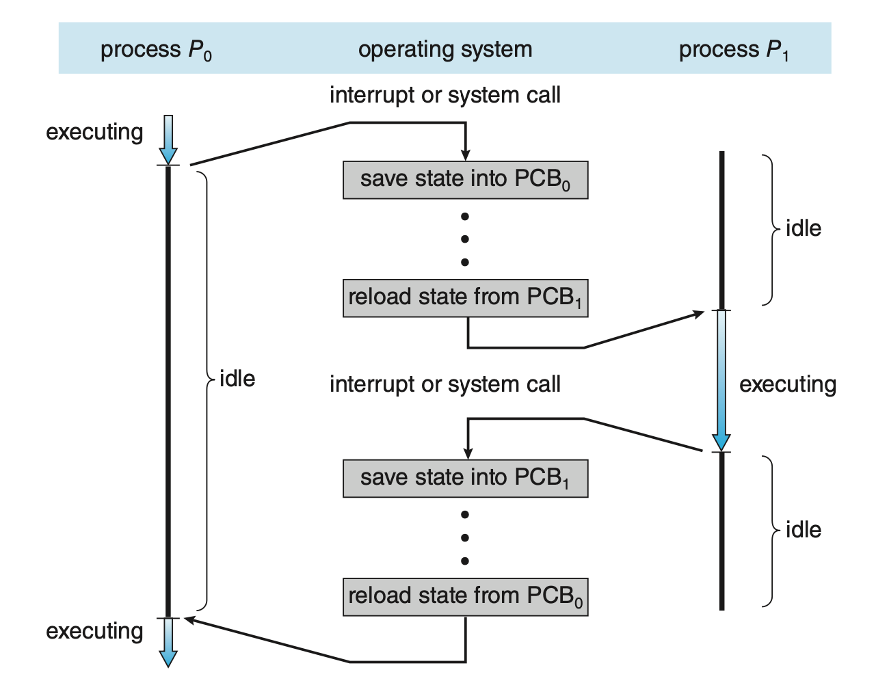
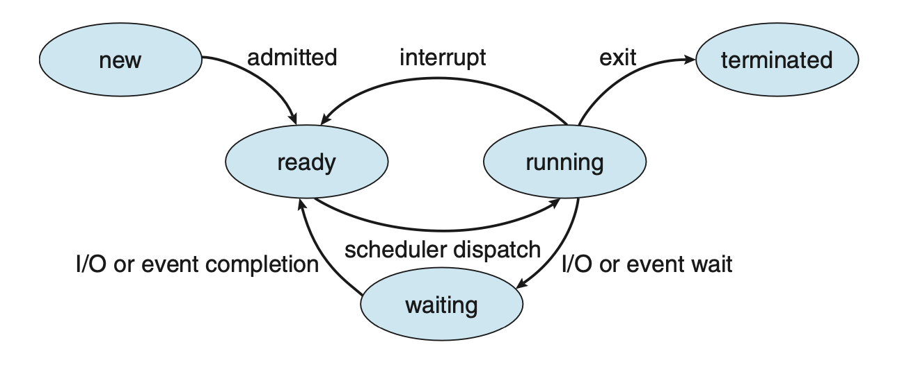

# Process

## 1. Process
- program in execution
- OS가 수행하는 연산 흐름의 관리 단위이다.
- 프로그램은 디스크에 명령어의 순서를 담고 있는 파일 형태로 저장된다. OS가 디스크에서 프로그램 실행 파일을 읽어와 메모리에 로드하면 프로그램은 프로세스가 된다.
  > OS가 디스크에서 실행 파일을 읽을 때 항상 프로그램 전부를 읽는 것은 아니다. 따라서 하나의 프로그램이 여러 개의 프로세스로 실행될 수 있다.
- 프로세스는 연산을 수행하기 위해 CPU와 Memory를 할당 받는다. 물리적으로는 RAM에서 메모리 할당을 받지만 실제 수행 중에는 가상 메모리를 할당 받을 수도 있다.
  > 가상 메모리는 RAM과 매핑될 수도 있고 HDD와 매핑 될 수도 있다.
- 프로세스의 실행 상태는 `program counter`와 `processor register`의 값들로 표현된다.

---

## 2. Process Address Space
- 프로세스는 `process address space`라는 가상 메모리 영역을 갖는다.

  

- text section
  * 실행 코드
- data section
  * 전역 변수
- heap section
  * 프로그램이 실행되는 동안 동적으로 할당되는 메모리
- stack section
  * 함수 호출을 위한 메모리
> logically contiguous but may not be physically contiguous...

---

## 3. PCB (Process Control Block)
- **The CPU defined structure that stores the state of the process.**
- CPU가 프로세스를 수행하는 중에 인터럽트가 걸리면 CPU는 프로세스 수행을 중단하고 인터럽트 명령을 수행한다. 따라서 CPU register의 프로세스 정보가 삭제되기 때문에 이를 나중에 다시 수행하기 위해서 프로세스 실행 정보를 어딘가에 저장해야 한다. 이를 위한 프로세스 정보 저장 공간이 `Process Control Block`이다.
- PCB는 커널 영역에 연결리스트 형태로 저장된다.  

- 

  - Process ID: 프로세스의 고유한 식별자. 양의 정수 값을 갖는다.
  - Process Priority: 프로세스의 우선순위를 나타내는 숫자이다. PCB가 생성될 때 지정되며 프로세스의 생성 시기, 소모하는 자원의 양 등에 의해 결정된다. 사용자가 임의로 지정할 수 있다.
  - Program Counter: 프로그램의 그 다음 명령어를 가리키는 포인터이다.
  - PCB Pointer: Ready 상태에서 대기 중인 다음으로 실행될 PCB의 주소를 가리킨다. 이는 OS가 parent process와 child process 간에 계층적인 control flow를 유지할 수 있도록 한다.
- PCB는 해당 프로세스의 생명주기(lifetime) 동안 존재한다. 프로세스가 종료되면 PCB도 삭제된다.
---

## 4. Context Switch
- `Time sharing`을 실현하기 위해 CPU를 점유하고 있는 프로세스는 계속 바뀌어야 한다. 따라서 현재 CPU core의 프로세스 실행 정보를 PCB에 저장한 후 `(state save)` 다른 프로세스의 PCB의 정보를 CPU로 읽어와 `(state restore)` 실행해야 한다.

- Context switch time은 pure overhead로 하드웨어의 성능에 좌우된다.

  > context switch 동안 프로세스들은 수행되지 않는다. Pure overhead...
---

## 5. Process State

* `New` : 프로그램이 디스크에서 로드되어 프로세스가 생성 중인 상태.
* `Ready`: 프로세스가 실행되기 전에 main memory에서 기다리는 상태. Ready Queue에서 대기하며 CPU 할당을 기다린다.
* `Running`: 프로세스가 CPU를 할당 받아 실행 중인 상태. 만약 CPU 개수가 n개라면 한 번에 실행 가능한 프로세스의 최대 개수도 n이다.
* `Waiting`: 프로세스가 I/O 인터럽트 등에 의해 잠시 멈춘 상태. I/O completion이나 signal을 기다린다.
* `Terminated`: 프로세스가 종료된 상태.
